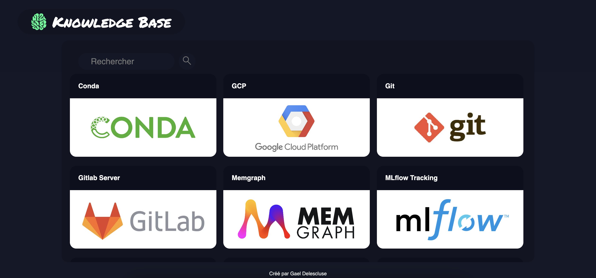

# APP Knowledge Base

[](LICENSE)

Here is my application presenting my knowledge base allowing me to easily find what I have learned.   

## Description  

An app built with React that makes it easy to find information I've learned, making it easier to reuse. It also allows me to share this information with beginners or anyone who needs support in their work.  



## Table of Contents

- [Getting Started](#Getting-Started)
- [Launch Application](#Launch-Application)
- [Contributing](#Contributing)
- [License](#License)  

## Getting Started    

```bash
git clone https://github.com/HaDock404/app-web-knowledge.git
cd app-web-knowledge
npm install
```  

## Launch Application    

```bash
npm start
```  

## Contributing

Pull requests are welcome. For major changes, please open an issue first
to discuss what you would like to change.

Please make sure to update tests as appropriate.

## License  

This project is licensed under the MIT License - see the [LICENSE](./LICENSE) file for details.